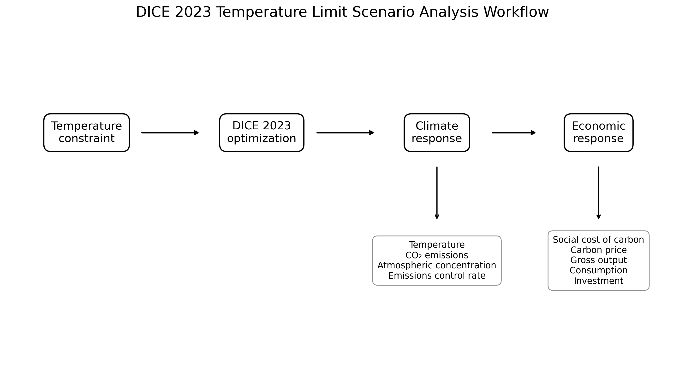
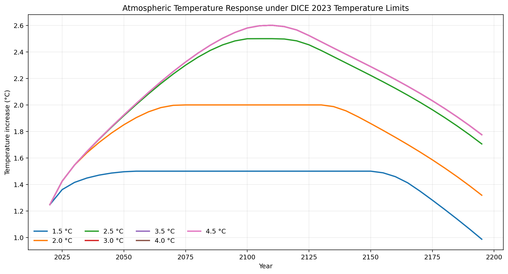
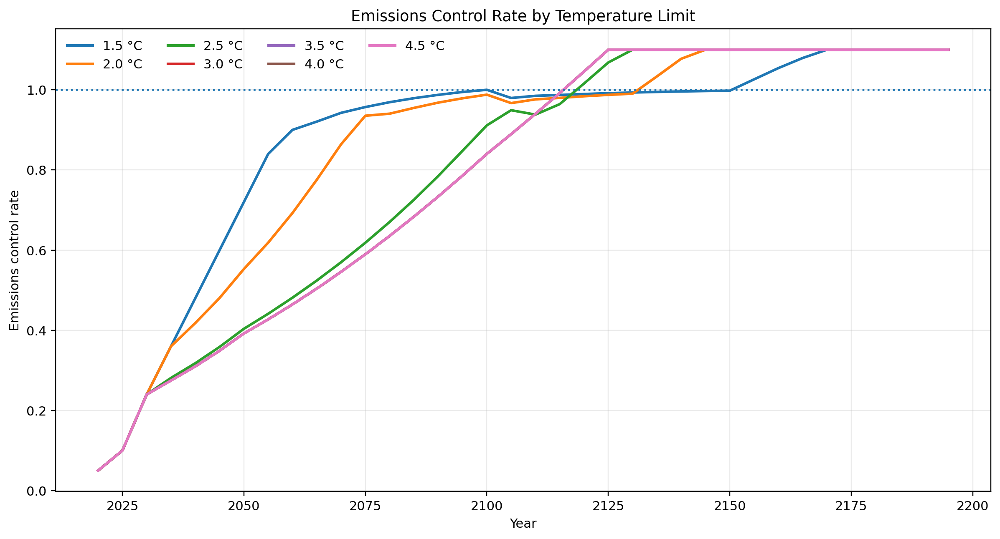
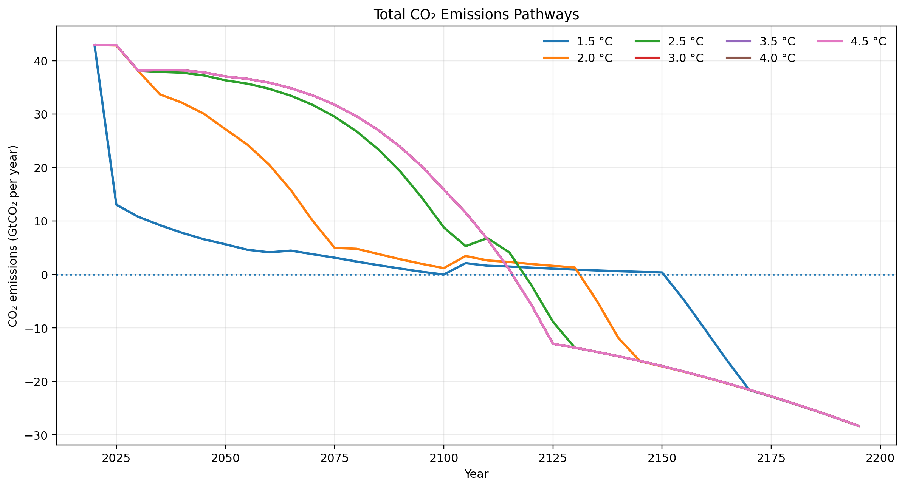
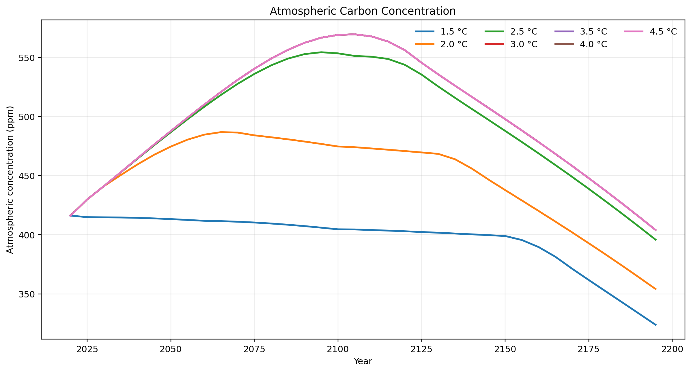
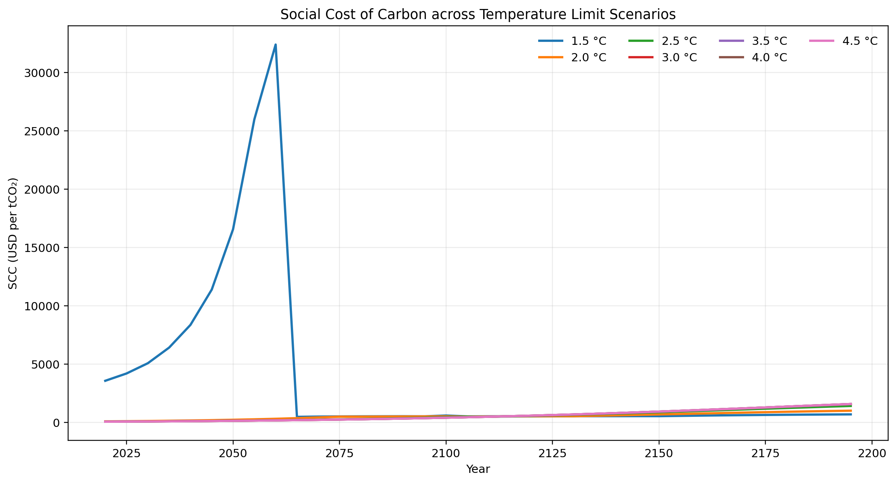
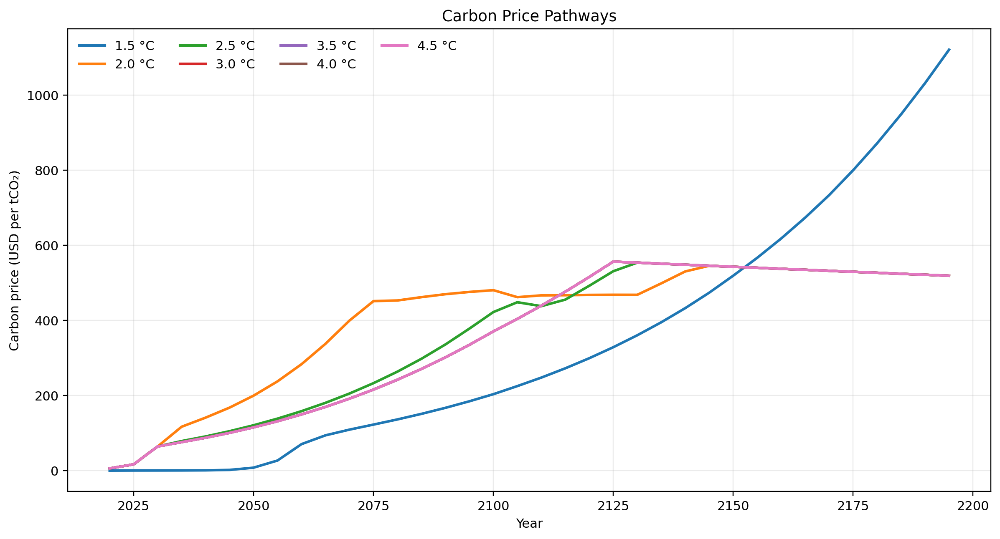
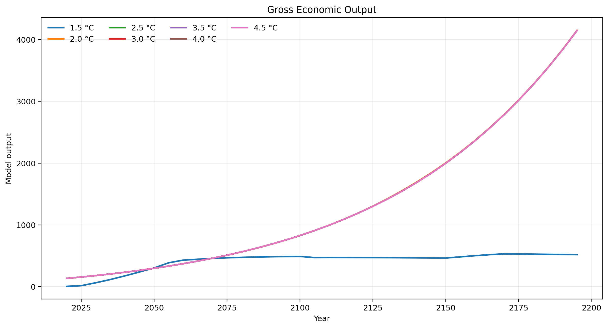
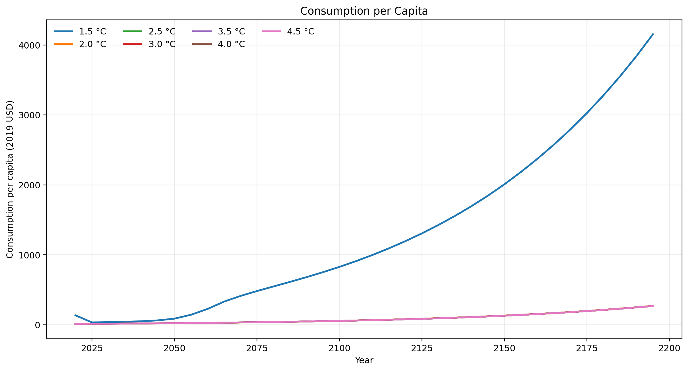
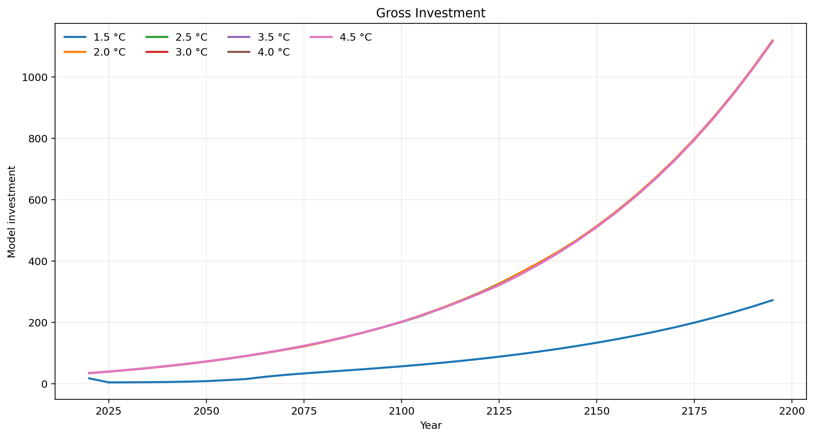

# DICE 2023 Temperature Limit Scenario Analysis

### Climate economics modelling and Python visualization of temperature constrained pathways

<p align="center">
<strong>DICE 2023 • Climate Economics • Integrated Assessment Modelling • Carbon Pricing • Social Cost of Carbon • Python • Scenario Analysis</strong>
</p>

---

## Project Overview

This project investigates how alternative **upper global temperature limits from 1.5 °C to 4.5 °C** affect climate and economic pathways in the **DICE 2023 integrated assessment model**.

The original academic study modified the upper temperature constraint and compared seven model cases. The analysis tracks how increasingly strict or relaxed temperature constraints influence emissions control, atmospheric temperature, carbon concentration, total CO₂ emissions, carbon pricing, the social cost of carbon and major economic variables.

For this GitHub portfolio version, the original Excel model output was reorganized into structured CSV datasets and reproducible Python visualizations.

---

## Research Question

**How does changing the upper temperature limit in DICE 2023 alter the balance between climate mitigation effort and long term economic outcomes?**

The seven evaluated scenarios are:

| Scenario | Upper temperature limit |
| --- | ---: |
| Case 1 | 1.5 °C |
| Case 2 | 2.0 °C |
| Case 3 | 2.5 °C |
| Case 4 | 3.0 °C |
| Case 5 | 3.5 °C |
| Case 6 | 4.0 °C |
| Case 7 | 4.5 °C |

The model results span **2020 to 2195** in five year intervals.

---

## Scenario Analysis Workflow



The analysis links a temperature constraint to DICE optimization and then evaluates both climate and economic responses.

---

# Climate Results

## 1. Atmospheric Temperature



Tighter scenarios constrain the temperature trajectory earlier. The 1.5 °C and 2.0 °C cases visibly bind the model, while higher limits allow a larger temperature increase before mitigation pressure becomes dominant.

---

## 2. Emissions Control Rate



The emissions control rate represents the fraction of baseline emissions reduced by mitigation. A value of **1.0 corresponds to complete control of modeled baseline emissions**, while values above 1 indicate net negative emissions in the model formulation.

The strictest temperature limits require rapid increases in mitigation effort.

---

## 3. Total CO₂ Emissions



Strict temperature constraints drive earlier reductions in total CO₂ emissions. In the most constrained pathways, the model later moves into negative emissions.

---

## 4. Atmospheric Carbon Concentration



The atmospheric concentration trajectories show how stronger mitigation reduces long term carbon accumulation compared with less restrictive temperature cases.

---

# Economic Results

## 5. Social Cost of Carbon



The **Social Cost of Carbon** represents the modeled marginal economic damage associated with an additional unit of CO₂ emissions.

The source analysis uses SCC as a key bridge between climate damages and economic decision making.

---

## 6. Carbon Price



The model carbon price reflects the economic signal associated with the emissions control pathway. More restrictive climate constraints generally require stronger near term mitigation incentives.

---

## 7. Gross Output



The economic output trajectories illustrate the tradeoff between mitigation expenditure, climate damages and long term economic growth.

---

## 8. Consumption per Capita



Consumption provides another view of how mitigation choices propagate through the economic system over the model horizon.

---

## 9. Gross Investment



Investment trajectories complement output and consumption by showing how capital allocation evolves under different temperature constraints.

---

# DICE Model Structure

DICE is an integrated assessment framework linking the economy, emissions, the carbon cycle, climate response and climate damages.

A simplified project workflow is:

```text
Economic activity
      |
      v
CO₂ emissions
      |
      v
Carbon cycle
      |
      v
Atmospheric temperature
      |
      v
Climate damages
      |
      v
Economic output and welfare

Mitigation policy acts through the emissions control rate and carbon price.
```

The source report highlights the following damage function:

```text
Ω(t) = ψ₁ T_AT(t) + ψ₂ [T_AT(t)]²
```

with the submitted model using:

```text
ψ₁ = 0
ψ₂ = 0.003467
```

The emissions relationship is represented as:

```text
E_CO2e(t) = E_CO2e_base(t) × [1 − μ(t)]
```

where `μ(t)` is the emissions control rate.

---

# Key Findings from the Academic Study

**Temperature constraints materially change the mitigation pathway**

Lower temperature limits require faster emissions control and earlier reductions in CO₂ emissions.

**Very strict constraints create large near term economic adjustments in the submitted model**

The 1.5 °C case shows particularly strong early changes in economic variables and carbon values.

**Carbon related economic indicators increase as climate damages and mitigation pressure change**

The project tracks both the social cost of carbon and the carbon price to connect the physical climate pathway with economic decision making.

**The original term paper interpreted 3 to 3.5 °C as a pragmatic model tradeoff**

This is retained here as the conclusion of the submitted classroom exercise. It should **not** be interpreted as a general scientific or policy recommendation outside the assumptions of this particular DICE exercise.

---

# Repository Structure

```text
dice2023 temperature limits

data
    dice_temperature_scenarios_long.csv
    scenario_milestones.csv
    atmospheric_temperature_increase_C.csv
    atmospheric_concentration_ppm.csv
    emissions_control_rate.csv
    total_CO2_emissions_GtCO2_per_year.csv
    social_cost_of_carbon_usd_per_tCO2.csv
    carbon_price_usd_per_tCO2.csv
    gross_output.csv
    consumption_per_capita_2019USD.csv
    gross_investment.csv

figures
    00_scenario_workflow.png
    01_atmospheric_temperature.png
    02_emissions_control_rate.png
    03_total_co2_emissions.png
    04_social_cost_of_carbon.png
    05_carbon_price.png
    06_atmospheric_concentration.png
    07_gross_output.png
    08_consumption_per_capita.png
    09_gross_investment.png

src
    visualize.py

docs
    methodology.md

README.md
requirements.txt
```

---

# Reproduce the Visualizations

Install the required packages:

```bash
pip install -r requirements.txt
```

Run:

```bash
python src/visualize.py
```

---

# Skills Demonstrated

| Area | Application |
| --- | --- |
| Climate economics | Temperature constrained DICE scenarios |
| Integrated assessment modelling | Climate economy interactions |
| Scenario analysis | Seven temperature limit cases |
| Carbon economics | Social cost of carbon and carbon price |
| Climate modelling | Temperature, concentration and emissions pathways |
| Economic analysis | Output, consumption and investment |
| Python | Data restructuring and reproducible visualization |
| Pandas | Scenario dataset preparation |
| Matplotlib | Engineering and economic visualizations |
| Excel modelling | Original DICE output evaluation |

---

# Portfolio Note

The public repository contains processed model outputs and independently generated Python visualizations.

The original group report and presentation are not included in the public package because they contain other students' personal information. This keeps the portfolio focused on the technical analysis while avoiding unnecessary publication of personal data.

---

# Academic Context

Developed as a group term project for the **Economics of Climate Change** course at **Friedrich Alexander University Erlangen Nürnberg**, Chair of Economic Theory.

Topic:

**Temperature Limit — Use Case DICE 2023**

---

# Author

## Nadeem Raza

Chemical Engineer  
M.Sc. Clean Energy Processes

Interests include energy system modelling, climate economics, hydrogen technologies, electrochemical systems and sustainable process engineering.

[LinkedIn](https://www.linkedin.com/in/nadeem-raza-255902208/)
